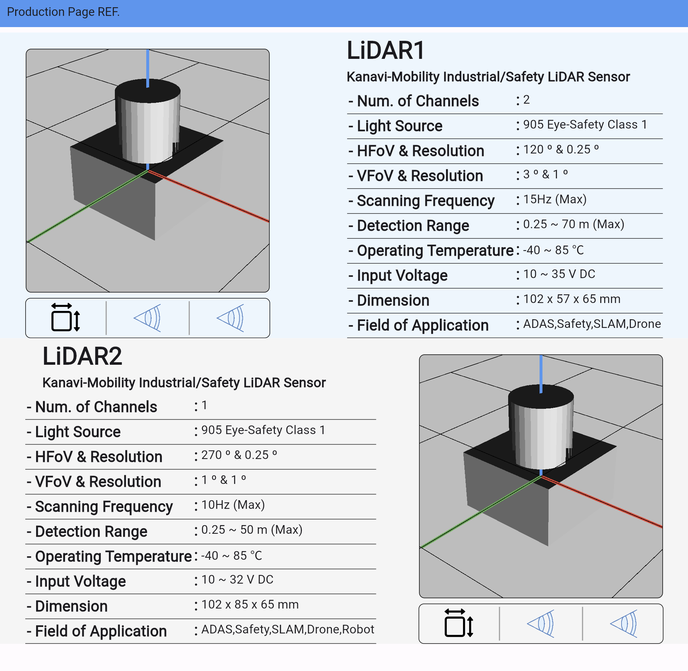

# web_prodution_page

A web Flutter project for Production Page.

## build

```bash
flutter create .
flutter pub get
flutter build web
```

## result



## deploy

[page](https://twchong831.github.io/web/)

### method

- make github repository
  - name.github.io
- copy flutter build web result
  - build/web
  - assets to build/web/assets
- rewrite index/html

```html
<!-- <base href="/"> -->
<base href="/web/">
```
